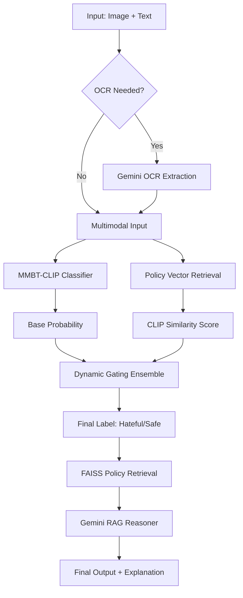

# 🛡️ Discri-Net: Hate Speech Guard

**Discri-Net** is a production-grade multimodal hate speech detection system designed to identify and explain harmful content in memes. By fusing state-of-the-art vision-language models with Retrieval-Augmented Generation (RAG), Discri-Net doesn't just flag content—it provides policy-grounded reasoning for every decision.

---

## 🚀 Key Features

- **Multimodal Fusion**: Leverages **MMBT-CLIP** (ViT-Large-Patch14) to jointly analyze image pixels and text captions.
- **Dynamic Policy Gating**: An innovative ensemble mechanism that boosts detection confidence when content aligns with a curated knowledge base of safety policies.
- **RAG Reasoner (Gemini)**: Powered by Google Gemini, the system generates natural language explanations based on retrieved safety guidelines (e.g., hate speech vs. vulgarity).
- **Automated OCR**: Built-in fallback to Gemini-Flash for extracting text from images when captions are missing.
- **Premium UI**: A modern, glassmorphic Gradio interface with real-time progress tracking and detailed technical breakdowns.

---

## 🏗️ Architecture

Discri-Net follows a "Consensus with Reasoning" pipeline:



---

## 🛠️ Tech Stack

| Component | Technology |
| :--- | :--- |
| **Backbone** | PyTorch, HuggingFace Transformers |
| **Vision-Language** | OpenAI CLIP (ViT-Large-Patch14) |
| **Reasoning Engine** | Google Gemini (Flash/Pro) |
| **Vector Search** | FAISS, LangChain |
| **Embeddings** | Sentence-Transformers (all-MiniLM-L6-v2) |
| **Frontend** | Gradio (Glassmorphic Design) |

---

## 📦 Installation

1. **Clone the repository**:
   ```bash
   git clone 
   cd Discri-Net-FYP-
   ```

2. **Install Dependencies**:
   ```bash
   pip install -r env.txt
   ```
   *Note: Ensure you have `torch` and `torchvision` installed for your specific CUDA version.*

3. **Environment Setup**:
   Create a `.env` file in the root directory:
   ```env
   GEMINI_API_KEY=your_api_key_here
   ```

---

## 🚀 Usage

### Running the UI
Launch the interactive web interface:
```bash
python app.py
```

### Training
To train the MMBT-CLIP model from scratch or fine-tune:
```bash
python train.py --config configs/your_config.yaml
```

### Dataset Preparation
Prepare standard datasets (Facebook Hateful Memes, MMHS):
```bash
python prepare_mmhs.py
python prepare_combined_dataset.py
```

---

## 📂 Directory Structure

- `app.py`: Main entry point for the Gradio interface.
- `model.py`: MMBT-CLIP architecture and projection logic.
- `langchain_rag.py`: RAG pipeline and Gemini LLM integration.
- `policy_rag.py`: Utilities for policy indexing and retrieval.
- `policies/`: Contains policy text (`example_policies.jsonl`) and pre-computed embeddings.
- `runs/`: Directory for saved model checkpoints.
- `results/`: Analysis reports and ensemble parameters.

---

## ⚖️ Safety & Ethics
Discri-Net is designed for academic research and platform moderation assistance. While highly accurate, the RAG reasoning should be used as a "copilot" for human moderators to ensure contextual nuance is always preserved.

---
*Developed by **Abdur Rehman** as part of the Discri-Net Final Year Project.*
